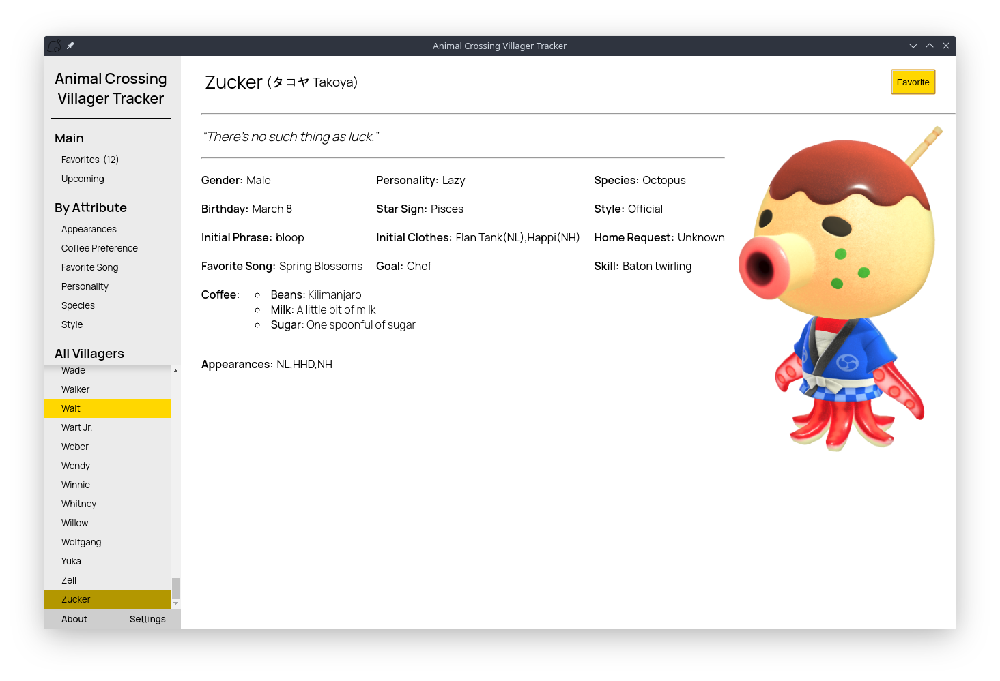

<div>
  
  <h1 margin="auto">animal-crossing-nh-villager-tracker</h1>
</div>


[](https://sass-lang.com/)
[](https://www.javascript.com/)
[](https://www.electronjs.org/)


View information on villagers in [Animal Crossing: New Horizons](https://www.animal-crossing.com/new-horizons/). 

## Contents

* [Description](#description)
* [Requirements](#requirements)
* [Installing](#installing)
* [Running](#running)
* [Roadmap](#roadmap)
* [Acknowledgements](#acknowledgements)

## Description

This project shows information on villagers present in [Animal Crossing: New Horizons](https://www.animal-crossing.com/new-horizons/). Villagers each have their own respective page of information, which lists information such as *Personality*, *Species*, *Coffee Preference*:



Villagers can be "favorite"-ed, which will add them to a special "favorites" page. Additionally, there are multiple pages that list all villagers based on a particular attribute, such as their *Personality*, *Species*, *Favorite Song*, etc. (Planned) Villagers will be able to be sorted by upcoming birthdays as well.

This project itself actually gets the villager data used from a [web scraper I made](https://github.com/bradendubois/animal-crossing-wiki-villager-scraper) that scrapes the [Animal Crossing Fandom wiki](https://animalcrossing.fandom.com/wiki/Animal_Crossing_Wiki). 

## Requirements

Using [electron-builder](https://www.electron.build/) to create Windows, OSX, and Linux builds is planned. At present, the project should be cross-platform, but cannot be run as a standalone program. You will need [NodeJS](https://nodejs.org/en/) installed to run the project.

## Installing

First, clone the repository and switch to the root of the repo:
```shell_script
git clone https://github.com/bradendubois/animal-crossing-nh-villager-tracker
cd animal-crossing-nh-villager-tracker
```

Then, install node dependencies:
```shell_script
npm install
```

In the future, this will not be necessary.

## Running

***Assuming the [above steps](#installing) have been followed:***

From the root of the project:
```shell_script
npm start
```

## Roadmap

- [ ] *Upcoming Birthday* support
- [ ] Improving general styling
- [x] Improving the *Favorites* page to show more information
- [ ] Improving the [web scraper I made](https://github.com/bradendubois/animal-crossing-wiki-villager-scraper) to handle a few edge cases of villager information.
- [ ] Adding search options to various pages to make finding particular villagers easier
- [ ] Adding sort features on the *Coffee Preferences* page to group by various *Bean*/*Milk*/*Sugar* preferences.
- [ ] Adding **Attribute** pages for *Appearances* and *Star Sign*.
- [ ] Toggling whether the preferred name is the English or Japanese.
- [x] Enabling a filter so that *Attribute* pages only show favorite-ed villagers
- [ ] A *Custom Search* page allowing villagers to be searched/filtered by any number and combination of attributes, such as *Personality*, *Species*, etc.
- [ ] Improve handling of villagers with multiple values for an attribute. (i.e., if a villager had a value *a* in some games, and it changes to *b* for later games, they will create a new entry on most tables for the unique value of *a*&*b*, when they *should* be listed under each respective entry, with a note specifying for which game(s) they held that value).

This Roadmap does not necessarily indicate the order things will be prioritized, and is always open to suggestions.

## Acknowledgements

* [electron-api-demos](https://github.com/electron/electron-api-demos), a repository used as an example to learn Electron. This project is heavily modelled after it and has a few remnants of code from it.
* [electron-store](https://github.com/sindresorhus/electron-store), a module to easily enable and access persistant userdata. 
* The [Animal Crossing Fandom Wiki](https://animalcrossing.fandom.com/wiki/Animal_Crossing_Wiki), for hosting all the data on the villagers; this data is scraped by [another project I made](https://github.com/bradendubois/animal-crossing-wiki-villager-scraper).
* The [Animal Crossing Leaf](https://commons.wikimedia.org/wiki/File:ACLeaf.svg) which I have modified to create the logo for the project. The icon is distributed under the [CC BY-SA 4.0](https://creativecommons.org/licenses/by-sa/4.0/deed.en) license.
